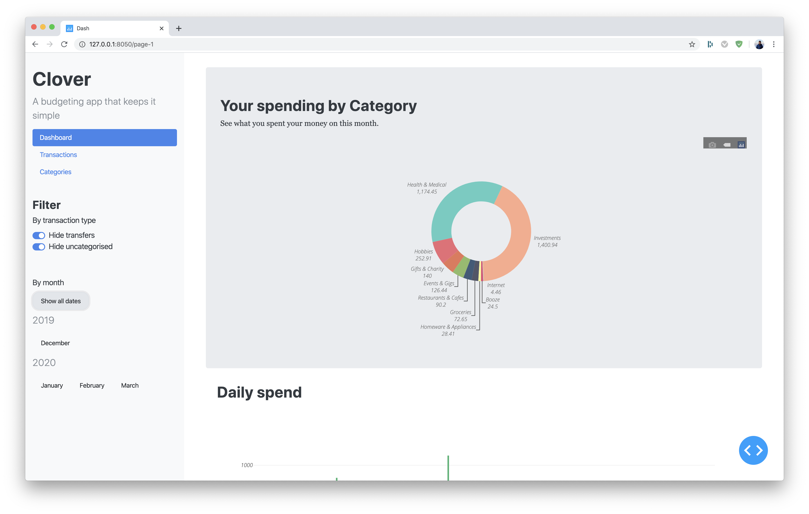

# Clover UI
A budgeting app that keeps it simple




## Development

```bash
git clone https://github.com/martinabeleda/clover-ui.git && cd clover-ui
```

We require [`poetry`](https://python-poetry.org/) to manage python dependencies:

```bash
pip install poetry

poetry install # install dependencies
```

To run the development server:

```bash
poetry run python app.py
```
